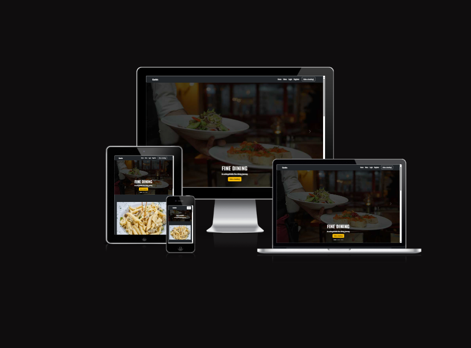

# Project Four Read Me

## Table of Contents
1. [The Project (with Screen Pic Included)](#the-project)
2. [UX](#ux)
3. [What Was Needed (Database/Web Page, with Pics)](#what-was-needed)
4. [Design (with Wireframes)](#design)
5. [Features (Current, Ones to Add)](#features)
6. [Technology](#technology)
7. [User Stories](#user-stories)
8. [Testing (Images, and W3C/PEP8)](#testing)
9. [Bugs](#bugs)
10. [Errors](#errors)
11. [Deployment](#deployment)
12. [Credits](#credits)

---

## The Project

[Click here](https://carlorestprojectfour-b96069fdda41.herokuapp.com/) to visit the Website.

We were tasked with creating a working web application using Python (Django), JavaScript, and HTML/CSS. We decided to create a restaurant website, for a restaurant called Carlo’s. We have a homepage, which includes a carousel, about me page, customer reviews, and gallery.

---

## UX

When it comes to UX, we can break this down into three parts: what we needed to create, the design of the application, and the features we have.

## Wireframes 

### Home screen

### Menu screen

### Filter & manage booking screen

### Login screen

### Create bookng screen

### What Was Needed

We needed a web application that could handle a basic database schema, to demonstrate our understanding of backend technologies, and our ability to display this in the frontend. We created a database that can have users sign up and be able to create bookings for meals in the restaurant.

### Design

We went for a black and white design to keep it simple and sleek. We’ve also added shades of gold/yellow to add a fine dining element to the page. We want the customer to feel like they’re dining in an above-market restaurant and include different images of people drinking/eating within the restaurant.

### Features

Lastly the features, when the user arrives on the page they’re firstly greeted with the home page, our nav bar is the first thing they will notice. Which also collapses down to a burger icon on smaller screens.

### **Navbar**

Our navbar has a make a booking/manage a booking function, which can only take you to manage/make a booking if the user is logged in, otherwise it takes you to a login page, this is to incentivise the user to sign up.

### **Carosuel**

Back on the home page we first introduce the user to a carousel image which has different pictures of the restaurant and has a make a booking button on each image, similar to the Navbar button which will take the user to the make a booking page, unless they’re not logged in which otherwise will take them to the login page.

Our carousel image also has a shadow/dark tint over the original image, this is to accentuate the writing that is on the image and to also expand on the dark/light theme of the page.

### **About me**

Next we have a short about us section to give the user a bit of information about the restaurant and what they have to offer, which also has a button for the user to view the menu.

 

 

### **Customer reviews**

The feature after this is our customer reviews section, we’ve included three different customers and the reviews that they’ve recently made.

### **Footer**

The last feature for this page is our footer section, it includes another small bio about the restaurant, a phone number, address and email contact, and lastly some social media links you can reach the restaurant on.

 

### **Gallery**

We also have a small gallery section of different food/drink images, this is a Bootstrap feature and allows the user to click into an image and click through them all.

### **Menu**

Our menu page is our next feature, which includes a starter, main, and dessert section, each has a title, price and description.

### **Login**

Our login page has a username and password for the user to log in with, as well as a link they can click if they would like to register, which takes us to that page.

### **Registration**

Here they can place information such as username, first name, password, email. We’ve added a feature that comes with Django forms that the user must fill in each field or they cannot progress, and that they must type their password twice to avoid any mistakes they may make. We also have a small list of rules they need to follow to make sure their account is secure (like not having their password too short, or common).We have error messages that will appear if any of these mistakes are made, for the user to know where they went wrong.

### **Login Success**

Next after a successful login or sign up our user will be taken back to the home page, and a message will appear in the Navbar to tell them they have successfully logged in, these messages will also appear if they have not been able to login, if they have registered, if they have made a booking or edited/deleted one.

### **Create booking**

When the user has logged in they are able to book a table, they have various different choices such as Meal time, special occasion, Meal day, Guests, and their name, we've added options for times and ocassions and added a datepicker for the day.

### **Manage booking**

After signing in they are able to make a booking, we have different fields that need to be filled in here with some custom error messages if the booking is done incorrectly, this can be down to the booking for that day on that time being already filled, if they put the guests as too low or too high (the guests must be from 1-6).

After the booking is made the user will be redirected to the manage booking page where they can see their bookings, and if none exist they will be told there are none, but be given a button to click if they would like to book a meal.

### **Edit and delete booking**

On this page they’re able to view their bookings with the relevant information, and also edit and delete their bookings.

### **Edit booking**

The edit booking will take them to another page where all their information is already filled in for them, and they’re able to change any information about the booking, this also has a the same error messages as the create a booking, if any information is entered incorrectly, after they’ve updated the booking the message will let them know it’s been updated successfully, next the delete button, once clicked they will be able to delete bookings, and a message will appear.

### **Expired bookings**

Another feature for this page is that any bookings that have expired (for example the date has passed) they will no longer be able to edit the bookings, only delete them, this is to ensure that users cannot keep making the same booking.

### **Datepicker**

When using the create/editing page, we’ve added a datepicker for the meal day field, we’ve also added a feature that does not allow the person to pick dates in the past as this would cause errors (the datepicker you're seeing allows past dates, this is only for admin filter), other datepickers do not allow this.

### **Filter bookings**

The next thing to mention is the manage a booking page from the admin/superuser perspective, we’ve added a filter so the restaurant owner can check how many bookings they have on a particular day, this feature is not available to a normal user, and they can only see/interact with their own bookings, whereas the superuser can see and interact with all bookings.

The filter bar is also a datepicker and is able to go into the past dates, in case the admin wanted to check on how many bookings they had on a specific date.

Once a date is picked they can search this date and see all the bookings for that date, this bar cannot be entered manually to stop any wrong inputs or errors being searched. 

There is also a reset feature which will bring the user back to the original manage a booking page.

### **Pagnation**

We’ve also added pagination to the manage a booking view, so the user can have their bookings laid out in a better way.

### **404 Page**

We have also styled the 404 page, to add to the UX.

### **Confirm delete**

Lastly, we included a confirmation button for the delete page, just in case the user clicks the delete button accidentally.

Next we can discuss some features that we would like to add.

Firstly having some video content would be something that would be great to add, alongside a blogpost and a link to individual dishes when the user clicks them.

Adding more filter options would be a good inclusion also, for example filtering by occasion. 

Adding a payment or takeaway reservation feature would also be something that will be added in the future.

### Technology

1. [Bootstrap:](https://getbootstrap.com/docs/5.3/getting-started/introduction/)
    - Bootstrap was used to assist with the responsiveness and styling of the website.
1. [Google Fonts:](https://fonts.google.com/)
    - Google fonts were used to import our additional fonts to our CSS.
1. [Font Awesome:](https://fontawesome.com/)
    - Font Awesome was used on all pages throughout the website to add icons for aesthetic and UX purposes.
1. [jQuery:](https://jquery.com/)
    - jQuery came with Bootstrap to make the navbar responsive, we also used it for some of our custom functions
1. [Git](https://git-scm.com/)
    - Git was used for version control by utilizing the Gitpod terminal to commit to Git and Push to GitHub.
1. [GitHub:](https://github.com/)
    - GitHub is used to store the projects code after being pushed from Git.
1. [HTML:](https://en.wikipedia.org/wiki/HTML5)
    - HTML was used for the structure of the web content.
1. [Python:](https://en.wikipedia.org/wiki/Python_(programming_language))
    - Python was the backend language for this project.
1. [Django:](https://en.wikipedia.org/wiki/Django_(web_framework))
    - Django was the framework that we used for python.
1. [CSS:](https://en.wikipedia.org/wiki/CSS)
    - CSS was used for the styling of the web page alongiside Bootstrap.
1. [JavaScript:](https://en.wikipedia.org/wiki/JavaScript)
    - JavaScript was used with the front end part of this project.

### User Stories

### John's Stories:

**First time visitor (John)**:

Upon landing on the website for the first time, I was immediately captivated by the stunning imagery and inviting layout of the homepage. Navigating to the menu section, I found it easy to explore the various culinary offerings, each accompanied by mouthwatering descriptions. Registering for an account was a breeze, and I appreciated the straightforward process that guided me through step by step. Making my booking was a seamless experience, with the intuitive interface allowing me to select my preferred date and time effortlessly. Overall, my first impression of the website was extremely positive, but I wished for more options to customize my booking to suit my preferences.

**Returning visitor (John)**:

Coming back to the website, I found the homepage just as inviting as I remembered, with its beautiful imagery and informative content about the restaurant's offerings. While the instructions were helpful during my first visit, I was able to navigate to the bookings page and enter a time for a new meal, and was told my booking was successful at the top which was great to see, next I was able to look at my booking in the manage a booking section, and also see my past bookings!

**Frequent visitor (John)**:

As a frequent visitor to the website, I found myself skipping past the homepage directly to the menu section, eager to explore the latest culinary delights. With my login details saved, accessing my account was a breeze, saving me time and hassle. However, I envisioned an advanced mode where I could customize my booking details further, such as selecting specific seating preferences or adding special requests for the chef. Despite these minor suggestions for improvement, I remained a loyal patron of the restaurant and looked forward to another memorable dining experience.

### Jane's Stories:

**First time visitor (Jane)**:

Upon arriving at the website for the first time, I was immediately struck by the vibrant images and enticing descriptions on the homepage. Navigating to the menu section, I browsed through the various dishes, each one making my mouth water. Registering for an account easy. Making my booking was easy also, with the messages that let you know you've booked. Overall, my first experience with the website was excellent, but I wished for more personalization during the booking process.

**Returning visitor (Jane)**:

Returning to the website, I found the homepage just as welcoming as before, with its appealing imagery and concise information about the restaurant. I was able to make my booking right away with my details saved and also call the restaurant on the number provided below with some questions I had.

**Frequent visitor (Jane)**:

Now a frequent visitor to the website, I went directly to the menu section, eager to explore the latest culinary offerings. With my login details saved, accessing my account already done which was very easy. Though the only thing I would like to see in the future is more options during the booking process, and possibly a takeout service.

---

## Testing

### Manual testing - our story 

When it comes to testing we had someone manually test the site, we tried to make incorrect bookings and below you can see all the error messages that arose.

We also tried to create users that had weak passwords, and not typed in their passwords the same alongside any other errors that would come from incorrect user input.

On the login page, we did the same and tried to put the information incorrectly.

On the make a booking page, we tested the error handling of the page and tried to make bookings that were on the same time and day, and also input incorrect amounts of guests.

On the edit a booking page, we tested the same to see if the bookings would be allowed to be made for the same day & time as others.

We also couldn’t see the bookings that other users had made if we weren’t the superuser.

Lastly, we entered as the super user and edited/deleted bookings and checked if those updates had been made for the original user too.

### Manual testing - user stories

### Sam's Stories:
- **Creating an Invalid Booking:**
  - Sam, attempting to create a booking, selected a date and time that overlapped with an existing booking on the system.
  - Upon submission, Sam received an error message indicating a scheduling conflict.
  - The error prevented Sam from creating the invalid booking and prompted to choose a different date or time.
  - 

- **Testing Unauthorized Access:**
  - Sam, as a logged-out user, attempted to access the "Create Booking" page without authentication.
  - Instead of accessing the page, Sam was redirected to the site's 404 error page, indicating access denied.
  - The error prevented unauthorized access, ensuring only authenticated users could create bookings.
  - 

### Emily's Stories:
- **Registering with Mismatched Passwords:**
  - Emily, a new user registering on the site, mistakenly typed different passwords in the "Password" and "Confirm Password" fields.
  - Upon submission, Emily received an error message indicating the passwords did not match.
  - The error prevented Emily from proceeding until she entered matching passwords.
  - 

- **Attempting to Edit Another User's Booking:**
  - Emily attempted to edit a booking made by another user.
  - The system recognized Emily's lack of permission to edit others' bookings.
  - The error prevented Emily from unauthorized access to other users' bookings.
  - Image not needed as it is the same as Sam's 404 error

### Max's Stories:
- **Attempting to Register with Weak Passwords:**
  - Max, a new user, attempted to register with a weak password.
  - Django's form validation system detected the weak password and prompted Max to choose a stronger one.
  - The error prevented Max from proceeding until he entered a stronger password.
  - 

- **Testing Booking Past Dates:**
  - Max intentionally selected a past date while attempting to make a booking.
  - The system detected the attempt to book a past date and displayed an error message.
  - The error prevented Max from completing the booking process with an invalid date.
  - 

# W3C Validation

### Home page 

### Menu

### Login

### Register

### Make booking

### Manage booking

### Edit booking

### Filter view

### CSS WC3

## PEP8 Checker

We also tested for PEP8 Checker, for our Python code

I would like to note that the migration files have not been all PEP8 compliant, but after checking with a CI representitive, I understand that any migration or empty files do not need to be PEP8 compliant.

## Lighthouse

Lastly, we checked our lighthouse score for our page, one thing to note is that the home page does have less performance score on mobile screens, this is something we’ve fixed as much as possible, one thing to note is that the performance could be better if we were able to use HTTP2 instead of HTTP1 requests, though Heroku only has this feature available for custom domains

### Home page 

### Menu

### Login

### Register

### Make booking

### Manage booking admin

### Manage booking user 

### Edit booking

### Filter view

---

## Bugs

Below we will discuss some of the numerous bugs we discovered and dealt with.

1. Wrong times being input after booking, we had a bug that would give the incorrect time for bookings once they had been made, this error came from a part of the code that was assigning the first available time of the day for every booking (regardless of what time you had booked for) we fixed this bug by changing that assignment of the first available time and leaving the choice as the original choice.

2. We also had another bug where any booking that had passed its date and was edited would cause an error in the database, as no past bookings could be made, we fixed this by removing the edit feature from past bookings, and only allowing the datepicker to select dates from today onwards, this not only fixed the bug but it also created a far better UX and added more authenticity to the site. Another bug that was found was being able to have the database run locally and be deployed on Heroku at the same time. We added some logic to the settings file which would allow for both to happen, so we could create fixes locally first which would speed up development.

3. Another bug we faced was in making the carousel image fit the page, this was difficult as the overlay of the shadow image meant that both needed to be resized, and some information that was already included from Bootstrap meant that the image was being stopped from resizing, we fixed this by investigating all the different CSS that had been applied to the element via Bootstrap, and this was fixed using Dev Tools.

4. We also encountered another bug when it came to Lighthouse performance, the solution was to take the CDN’s out of the base.html and add them where relevant, also to compress images and text as much as we could by retaining the quality as much as possible.

---

## Errors

Below we've listed all the ways that we can handle errors.

### Login errors

Incorrect login, we've added a message in the Navbar for this error.

### Unauthorized access errors

Not allowed accces, if someone tries to access a create booking page, and they're not logged in, or any other page they aren't allow access, we have our 404 page

### Registering erros

Registering, we have Django's form errors working here, not allowing the user to leave any field blank, or not having both passwords be matching, or having passwords be similar. 

We also included this information for the person so they can see what they need to correct.

### Making booking errors 

Making a booking, we've applied the same Django requirements here, so nothing can be left blank, we've also added in a feature that cannot allow bookings in the past, not allow guests to be below one or above six (just to display we can handle these types of errors), and not allowed dates in the past to be booked, which can be done if you manually enter a date instead of picking one.

### Edit booking errors

When it comes to the edit booking, the error handling is the same.

### Searching for past errors

As for the filter option, we allowed bookings to be searched for in the past, as for an owner this feature is needed, though, we've only allowed the user to be able to search once they've selected from the datepicker, to avoid any input that cause issues.

---

## Deployment

The project was deployed to Heroku using the following steps:

Log in to Heroku and access the [Heroku](https://www.heroku.com/).
The published site can be accessed [Here](https://carlorestprojectfour-b96069fdda41.herokuapp.com/)

Access the [GitHub Repository](https://github.com/Connall1234/rest_booking).
Click "Fork" at the top right of the repository.
Making a Local Clone
To clone the repository locally, follow these steps:

Access the [GitHub Repository](https://github.com/Connall1234/rest_booking).
Click "Clone or download" and copy the URL under "Clone with HTTPS."
Open Git Bash and navigate to the desired directory.
Enter git clone followed by the copied URL.

The project was deployed using Heroku. Here are the steps for deployment:

1. Fork or clone this repository.
2. Create a new Heroku app.
3. Set the buildbacks to Python and NodeJS in that order.
4. Link the Heroku app to the repository.
5. Click on Deploy.

---

## Credits

I would like to thank Code Institute for all the help they've given with this particular project, and for the teaching they've given,
I would also like to thank my mentor for helping me with this project.
I would also like to state that the photos used in this project are for educational purposes only, I do not own the rights to any of these images.